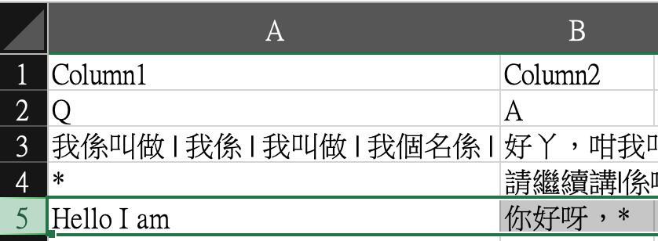
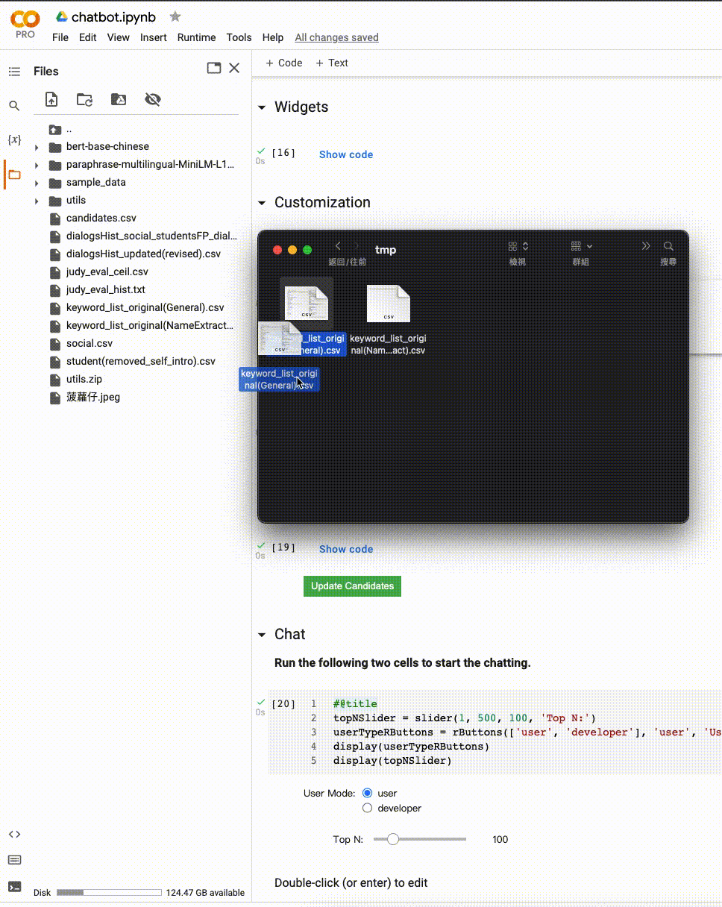

# <p align="center"> CantoneseChatbot_v2 </p>

<div align="center">
<b>City University of Hong Kong<br>
<a href="https://drive.google.com/drive/folders/1fdaQm211O7kEdkWtDgXQ4-7XekPBswdI?usp=sharing"> Data <br></a>
<a href="https://drive.google.com/drive/folders/1hXSx1iD_v5fDYlUBWfw2HnltsHkD1pe_?usp=sharing"> Fine-Tuned Model <br></a>
<a href="https://colab.research.google.com/drive/1Bb-AkcUjxgeKkFqjjvO8lSNPqKTY98z5?usp=sharing"> Demo On Google Colab <br></a>
</b>
</div>

## How to run

### Keywords Customization
#### Prerequisite
* Any text editor that can be used to edit the CSV file (e.g., Excel, Visual Studio Code, Notebook and etc) 
1. Go to the "Keyword Customization" Section


2. Click the button on the first cell in the section. It will automatically download the template of keywords list files. 
When the download is finished, unzipping the file and you will see the following folder structure.
```
|--custom_keywords
  |--keyword_list_custom(General).csv
  |--keyword_list_custom(NameExtract).csv 
```
* keyword_list_custom(General).csv 
  * Used for all keyword-based reply
* keyword_list_custom(NameExtract).csv 
  * Used for only name-extraction reply

3. According to the purpose, you can open the corresponding file and insert the case to it.
    - E.g., You want to insert a new keyword-case for name-extraction (e.g., Q: "Hello I am xxx", A: "你好呀，xxx"). You can insert it as a new row into the <b>keyword_list_custom(NameExtract).csv</b>
</br>
   - When the editing is finished, please "drag and drop" the updated keyword file to the "Files" section at the left side of Colab.
</br>
</br>

1. The chatbot will depend on whether there is a user-customized keywords list to select the keywords file for generating the general-reply. In the above demonstration, I added a case to the “NameExraction” keyword list and uploaded this customized version to the application. Thus, the customized version of “NameExtraction” keyword list will be used instead of the original version.
