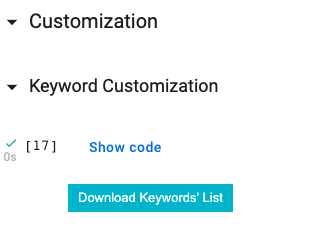

# <p align="center"> CantoneseChatbot_v2 </p>

<div align="center">
<b>City University of Hong Kong<br>
<a href="https://drive.google.com/drive/folders/1fdaQm211O7kEdkWtDgXQ4-7XekPBswdI?usp=sharing"> Data <br></a>
<a href="https://drive.google.com/drive/folders/1hXSx1iD_v5fDYlUBWfw2HnltsHkD1pe_?usp=sharing"> Fine-Tuned Model <br></a>
<a href="https://colab.research.google.com/drive/10QPce8Ten-m8HVFLYDcaDmiieyIa9Stx"> Demo On Google Colab <br></a>
</b>
</div>

<div align="center"></br></div>

## How to use
1.   Click "Demo On Google Colab" in above.
2. When you are directed to Google Colab, please click "Runtime" > "Run all" in the menu bar.
   * The configuration steps may take a few minutes to run
3.   When the configuration is completed, scroll to the bottom of the webpage. Enjoy the chatting :)

## Customization

#### Prerequisite
* Any text editor that can be used to edit the CSV file (e.g., Excel, Visual Studio Code, Notebook and etc) 

#### Keywords Files

1. Go to the "Keyword Customization" Section
</br>

2. Click the button on the first cell in the section. It will automatically download the template of keywords list files. 
When the download is finished, unzipping the file and you will see the following folder structure.
```
  |--keyword_list_custom(General).csv
  |--keyword_list_custom(NameExtract).csv 
```
* keyword_list_custom(General).csv 
  * Used for all keyword-based reply
* keyword_list_custom(NameExtract).csv 
  * Used for only name-extraction reply

3. According to the purpose, you can open the corresponding file and insert the case to it.
    - E.g., You want to insert a new keyword-case for name-extraction (e.g., Q: "Hello I am xxx", A: "你好呀，xxx"). You can insert it as a new row into the <b>keyword_list_custom(NameExtract).csv</b>
</br>
   - When the editing is finished, please "drag and drop" the modified file to the "Files" section at the left side of Colab.
</br>
</br>

1. The chatbot will depend on whether there is a user-customized keywords list to select the keywords file for generating the general-reply. In the above demonstration, I added a case to the “NameExraction” keyword list and uploaded this customized version to the application. Thus, the customized version of “NameExtraction” keyword list will be used instead of the original version.
</br>

#### Candidates Pool
1. Go to the "Candidates Pool Customization" Section
</br>

2. Click "Download Candidates Pool" button to get the "candidates.csv" file.
   * Same as the Keywords customization, you can add a new row to the file as a new candidate for the chatbot.
3. When the editing is finished, please "drag and drop" the modified file to the "Files" section at the left side of Colab.
   * Please refer to the same process at Keywords customization
4. When the upload is finished, please click the "Update Candidates" button to update the candidates pool.

